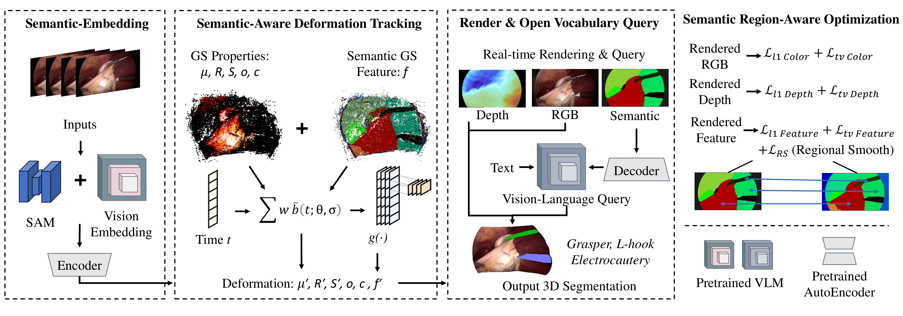

<p align="center">

  <h1 align="center">SurgTPGS: Semantic 3D Surgical Scene Understanding with Text Promptable Gaussian Splatting</h1>

  <h2 align="center">MICCAI 2025</h2>
  <p align="center">
    <a href="https://github.com/lastbasket"><strong>Yiming Huang*</strong></a>,
    <a href="https://longbai-cuhk.github.io/"><strong>Long Bai*</strong></a>,
    <a href="https://beileicui.github.io/"><strong>Beilei Cui*</strong></a>,
    <strong>Yanheng Li</strong>,
    <a href="https://flaick.github.io/"><strong>Kun Yuan</strong></a>,
    <br>
    <a href="https://gkwang-cuhk.github.io/"><strong>Guankun Wang</strong></a>,
    <a href="https://mobarakol.github.io/"><strong>Mobarak I. Hoque</strong></a>,
    <a href="https://camma.unistra.fr/npadoy/"><strong>Nicolas Padoy</strong></a>,
    <a href="https://www.professoren.tum.de/en/navab-nassir"><strong>Nassir Navab</strong></a>,
    <a href="https://www.ee.cuhk.edu.hk/ren/"><strong>Hongliang Ren</strong></a>
  </p>
  <h3 align="center"> || <a href="https://arxiv.org/abs/2506.23309">Paper</a> || <a href="https://lastbasket.github.io/MICCAI-2025-SurgTPGS/">Project Page</a> || </h3>
  <div align="center"></div>
</p> 
<p align="center">
  <a href="https://lastbasket.github.io/MICCAI-2025-SurgTPGS/">
    
  </a>
</p>


## Citation
```
@misc{huang2025surgtpgssemantic3dsurgical,
      title={SurgTPGS: Semantic 3D Surgical Scene Understanding with Text Promptable Gaussian Splatting}, 
      author={Yiming Huang and Long Bai and Beilei Cui and Kun Yuan and Guankun Wang and Mobarakol Islam and Nicolas Padoy and Nassir Navab and Hongliang Ren},
      year={2025},
      eprint={2506.23309},
      archivePrefix={arXiv},
      primaryClass={eess.IV},
      url={https://arxiv.org/abs/2506.23309}, 
}
```
<p align="center">
