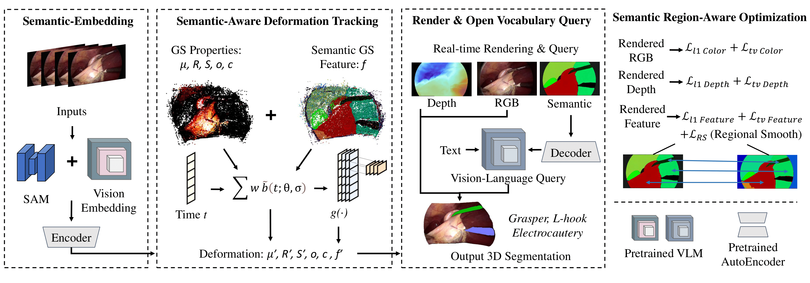

<p align="center">

  <h1 align="center">SurgTPGS: Semantic 3D Surgical Scene Understanding with Text Promptable Gaussian Splatting</h1>

  <h2 align="center">MICCAI 2025</h2>
  <p align="center">
    <a href="https://github.com/lastbasket"><strong>Yiming Huang*</strong></a>,
    <a href="https://longbai-cuhk.github.io/"><strong>Long Bai*</strong></a>,
    <a href="https://beileicui.github.io/"><strong>Beilei Cui*</strong></a>,
    <a href="https://flaick.github.io/"><strong>Kun Yuan</strong></a>,
    <br>
    <a href="https://gkwang-cuhk.github.io/"><strong>Guankun Wang</strong></a>,
    <a href="https://mobarakol.github.io/"><strong>Mobarak I. Hoque</strong></a>,
    <a href="https://camma.unistra.fr/npadoy/"><strong>Nicolas Padoy</strong></a>,
    <a href="https://www.professoren.tum.de/en/navab-nassir"><strong>Nassir Navab</strong></a>,
    <a href="https://www.ee.cuhk.edu.hk/ren/"><strong>Hongliang Ren</strong></a>
  </p>
  <h3 align="center"> || <a href="https://arxiv.org/abs/2506.23309">Paper</a> || <a href="https://lastbasket.github.io/MICCAI-2025-SurgTPGS/">Project Page</a> || </h3>
  <div align="center"></div>
</p> 
<p align="center">
  <a href="https://lastbasket.github.io/MICCAI-2025-SurgTPGS/">
    
  </a>
</p>


## Environment
1. Install the CUDA toolkit on ubuntu from [Download link](https://developer.nvidia.com/cuda-11-7-0-download-archive?target_os=Linux&target_arch=x86_64&Distribution=Ubuntu), and then:
```shell
export PATH=/usr/local/cuda-11.7/bin:${PATH}
export LD_LIBRARY_PATH=/usr/local/cuda-11.7/lib64:$LD_LIBRARY_PATH
export CUDA_HOME=/usr/local/cuda-11.7
```
2. Install the Python environment
```bash
git clone https://github.com/lastbasket/SurgTPGS
cd SurgTPGS
conda create -n SurgTPGS python=3.7 
conda activate SurgTPGS

pip install -r requirements.txt
pip install -e submodules/depth-diff-gaussian-rasterization
pip install -e submodules/simple-knn
```
## Datasets and Pre-trained Checkpoints
1. We have the processed version of CholeSeg and EndoVis 2018 datasets with disparity maps. Download the datasets from the [Download Link](https://mycuhk-my.sharepoint.com/:u:/g/personal/1155209042_link_cuhk_edu_hk/EY6gIiInSf5MuE0_JsMQczgBqnrAum4rNDhDgqEIHvkRVg?e=1FsUTQ), unzip to the following structure:
```
├── data
│   ├── cholecseg_sub
│   |   ├── video01_00080
│   |   ├── video01_00240
│   |   ├── ...
│   ├── endovis_2018
│   |   ├── seq_5_sub
│   |   ├── seq_9_sub
```

1. Download the [SAM checkpoint](https://mycuhk-my.sharepoint.com/:u:/g/personal/1155209042_link_cuhk_edu_hk/ETiE8JCmwwxPkVGgju_jUe8BVz5wIck9iwRcqcxXyUQ9fQ?e=EShVoO), VLM(CLIP finetuned with CAT-Seg): [CholecSeg checkpoints](https://mycuhk-my.sharepoint.com/:u:/g/personal/1155209042_link_cuhk_edu_hk/ETUWKjQn7BFApDNMAu9ww8EBqoBQzsuu6tskruszSusCzQ?e=mqcbfk), and [EndoVis 2018](https://mycuhk-my.sharepoint.com/:u:/g/personal/1155209042_link_cuhk_edu_hk/Efj3vkX239lOizRyWpkl23QBKe8iy5PYN2Yscb0W_v2UqA?e=ks1Zo1). Placing the checkpoints as:
```
├── ckpts
│   ├── model_final_cholecseg.pth
│   ├── model_final_endovis.pth
│   ├── sam_vit_h_4b8939.pth
```
  

## Training
```bash
# 1. data processing for VLM and SAM features
bash pre_data.sh
# 2. use the autoencoder for the semantic features
bash pre_VL_features.sh
# 3. train the SurgTPGS
bash train.sh
```

## Rendering and Evaluation
```bash
# 1. render the RGB, Depth, and semantic features
bash render.sh
# 2. eval the semantic segmentation on novel view with text prompt
bash eval_fine.sh
```

## Related Works
Welcome to follow our related works:
- [Endo-4DGX](https://lastbasket.github.io/MICCAI-2025-Endo-4DGX/): Robust Endoscopic Gaussian Splatting with Illumination Correction
- [Endo2DTAM](https://github.com/lastbasket/Endo-2DTAM): Gaussian Splatting SLAM for Endoscopic Scene
- [Endo-4DGS](https://github.com/lastbasket/Endo-4DGS): Monocular Endoscopic Scene Reconstruction with Gaussian Splatting

## Citation
```
@misc{huang2025surgtpgssemantic3dsurgical,
      title={SurgTPGS: Semantic 3D Surgical Scene Understanding with Text Promptable Gaussian Splatting}, 
      author={Yiming Huang and Long Bai and Beilei Cui and Kun Yuan and Guankun Wang and Mobarakol Islam and Nicolas Padoy and Nassir Navab and Hongliang Ren},
      year={2025},
      eprint={2506.23309},
      archivePrefix={arXiv},
      primaryClass={eess.IV},
      url={https://arxiv.org/abs/2506.23309}, 
}
```
<p align="center">
